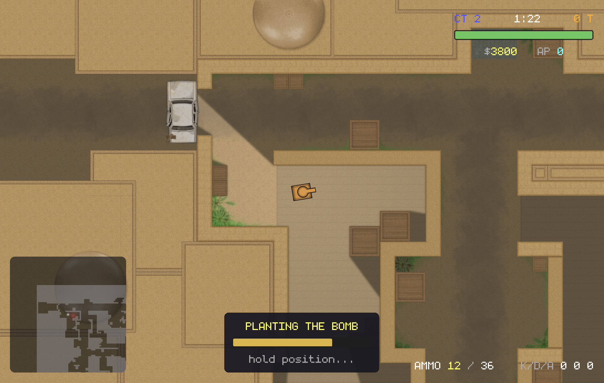

# embrik

**A server-authoritative multiplayer 2D game engine where the game itself is a Luau mod, not hardcoded rules.**

One binary is the whole stack: client, listen-server, or headless dedicated server. The engine ships zero gameplay. Components, weapons, economies, round logic, HUDs, and win conditions all live in hot-reloadable server-side Luau mods, replicated to clients automatically. Everything below shows **CS-mode**, a complete CT-vs-T bomb defusal gamemode written entirely as a mod, running on the same engine that could just as well run a platformer or a top-down shooter.



## Highlights

- **Netcode that holds up side by side**: fixed 60 Hz server-authoritative simulation, client prediction through a box2d shadow world, time-dilated input pacing, lag-compensated hits, and remote players extrapolated to server-present, so what an observer sees matches the shooter's screen almost 1:1. Run with `--netgraph` for live telemetry.
- **Replication is automatic**: any component tagged networked serializes from ECS reflection, including components defined in Luau. Deltas are deduplicated per peer, interest-managed, and static entities cost nothing.
- **WebGPU renderer**: shadow-casting lights, line-of-sight fog of war, GPU particles, custom WGSL materials, HDR post stack, and fixed-timestep render interpolation.
- **Destructible chunked tile world** streamed by interest, with greedy-meshed box2d collision and per-tile HP.
- **Three predicted control schemes** (differential, top-down, platformer) selected per entity by a replicated component; prediction never runs scripts.
- **Mods own everything else**: server-driven UI, content-addressed asset delivery to clients, typed chat commands, manifest-declared dependencies, and `world.reload()` hot-swapping the whole mod set live.

## What a mod looks like

Real code from CS-mode, lightly trimmed.

**Components are type declarations.** Exporting a type registers the component; `Replicated<>` streams it to clients automatically, `Component<>` stays server-side. Prototypes bundle components into named, spawnable definitions:

```lua
-- data.luau: runs once at load, declares what exists
export type Health = Replicated<{ current: number, max: number }>  -- clients need it for the HUD bar
export type Team = Component<{ side: number }>                     -- server-only state
export type Munition = Component<{ damage: number }>               -- read on EventHit

export type GunProto = Prototype<{ ProjectileWeapon: ProjectileWeapon, Munition: Munition, Ammo: Ammo? }>

GunProto:define("pistol", { ProjectileWeapon = { cooldown = 16, speed = 440, muzzle = 26, life = 3.0 },
                            Munition = { damage = 26 }, Ammo = { mag = 12, reserve = 36, mag_size = 12, reload_time = 1.4 } })
GunProto:define("awp",    { ProjectileWeapon = { cooldown = 78, speed = 820, muzzle = 30, life = 5.0 },
                            Munition = { damage = 120 }, Ammo = { mag = 5, reserve = 20, mag_size = 5, reload_time = 2.8 } })
```

**The engine spawns no player avatar.** The mod declares the body and hands the player control; the engine fills in the input buffer, prediction, firing clock, lag-comp history, ownership, and replication from the components it sees:

```lua
events.on(function(e: EventPlayerJoin)
    local side = (#M.players_on(M.CT) <= #M.players_on(M.T)) and M.CT or M.T
    local sp = M.pick_spawn(side)
    local body = world.spawn{
        Position = { x = sp.x, y = sp.y },
        Rotation = { angle = 0 },
        CollisionBox = { width = 40, height = 30 },
        DifferentialStats = { speed = 160, turn = 3.4 },
        Controller = { scheme = ControlScheme.Differential },
        Dynamic = {},
        HitBox = {},
    }
    e.player:control(body)
    body:sprite({ { tex = "core/tank.png" }, { tex = "core/turret.png", pivot = { 0.25, 0.5 } } })
    body.Health = { current = 100, max = 100 }
    body.Money = { amount = M.START_MONEY }
    M.give(body, "pistol")
end)
```

**Chat commands are declarative.** Argument types come from the handler's annotations; a union of string literals becomes client-side autocomplete, and `§` codes color the reply:

```lua
command.register("team", {
    description = "Switch sides (ct or t)",
    run = function(ctx, side: "ct" | "t")
        local e = ctx.player and ctx.player:entity()
        if not e then return end
        e.Team = { side = (side == "ct") and M.CT or M.T }
        if not e:has(Dying) then e:add(Dying) end   -- sit out until next round
        ctx:reply("§aMoved to " .. side .. " §7(respawn next round)")
    end,
})
```

**UI is server-driven.** A mod composes a view and opens it on a specific player's screen; `{Ammo.mag}` inside a label binds to the live replicated component client-side (no per-frame messages), and button handlers are plain closures that run back on the server when clicked:

```lua
function M.killfeed_view(e)
    local col = { placement = ViewPlacement.BottomRight }
    for _, k in ipairs(M.killfeed) do
        col[#col + 1] = view.label(k.text)
    end
    local st = M.stats[e:id()] or { kills = 0, deaths = 0, assists = 0 }
    col[#col + 1] = view.label(("§fAMMO §e{Ammo.mag} §7/ §f{Ammo.reserve}    §7K/D/A §f%d %d %d")
        :format(st.kills, st.deaths, st.assists))
    return view.column(col)
end

player:open_view("killfeed", M.killfeed_view(body))

-- interactive views: the handler is a closure, invoked server-side on click
view.button("§7Close", function(ctx) ctx:close_view("buy") end)
```

**Manifests declare identity and dependencies.** Load order is resolved topologically, and a mod can be parked with `enabled` without deleting it:

```json
{ "name": "core", "version": "1.0.0", "description": "CS-mode gamemode", "depends": ["dust2"] }
```

## Build & run

```sh
xmake                                         # build
xmake run embrik                              # client (menu, then host or connect)
xmake run embrik -- --server --port 5000      # dedicated headless server
xmake run embrik -- --connect 127.0.0.1:5000  # connect directly
xmake run embrik -- --connect 127.0.0.1:5000 --netgraph   # with live net telemetry
```

The engine loads mods from `mods/` at startup, ordered by their manifest dependencies. The CS-mode gamemode and its dust2 map shown above are not part of this repository yet; they will be published as reference mods.

## Status

The engine is feature-complete across its planned phases: netcode (stable and measured), renderer, physics and control schemes, asset pipeline, server-driven UI, graphics settings, touch controls, and the mod manifest system. What remains is content and polish: publishing the reference mods, mod-driven menu branding, and playtesting the touch overlay on real touch hardware. TankPvP itself becomes just another mod.
