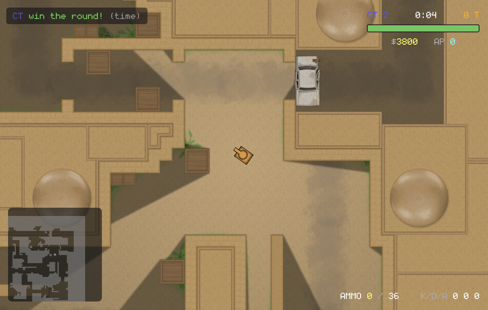

# tankpvp

**A server-authoritative multiplayer 2D game engine where the game itself is a Luau mod, not hardcoded rules.**

One binary is the whole stack: client, listen-server, or headless dedicated server. The engine ships zero gameplay. Components, weapons, economies, round logic, HUDs, and win conditions all live in hot-reloadable server-side Luau mods, replicated to clients automatically. The name is a leftover from the prototype; everything below shows **CS-mode**, a complete CT-vs-T bomb defusal gamemode written entirely as a mod, running on the same engine that could just as well run a platformer or a top-down shooter.


## Why it exists

Most 2D multiplayer projects hardcode one game and bolt networking on top. tankpvp inverts that: the engine owns the hard, generic problems (netcode, prediction, rendering, physics, asset delivery) and exposes them to scripts as data. A mod never touches a socket, never interpolates a position, and never worries about packet loss. It declares what exists; the engine makes it true on every screen.

## The netcode

Built from scratch, tuned until two side-by-side clients match almost 1:1:

- **Server-authoritative simulation** at a fixed 60 Hz. Clients send input intents; the server is the only truth.
- **Client prediction** replays unacknowledged inputs through a box2d shadow world each tick, with error feedback that absorbs corrections smoothly instead of snapping.
- **Micro time dilation** paces the client against the server: exactly one input per tick, cadence adjusted by up to 2% to hold the server's input buffer at target. No stalls, no double-steps, no rubber-banding.
- **Remote players extrapolate to server-present** using replicated velocities, so a shot you see leave someone's barrel leaves at the barrel you are looking at, at the angle you are looking at.
- **Lag-compensated hits**: the server rewinds hitboxes to what the shooter actually saw, with swept collision so fast bullets cannot tunnel through targets.
- **Registry-driven replication**: any component tagged networked serializes automatically from ECS reflection, including components defined in Luau. Deltas are deduplicated per peer, interest-managed by radius, and static entities freeze out of the hot path entirely.
- **Instrumented, not guessed**: run any instance with `--netgraph` for live rtt/jitter/buffer/prediction-error telemetry on the client, tick-gap and input-queue health on the server, and wall-clock frame pacing in the renderer.

## The rest of the engine

- **WebGPU renderer**: 2D shadow-casting lights, line-of-sight vision cones (fog of war), GPU particles, per-sprite materials and custom WGSL shaders, HDR post stack, and fixed-timestep render interpolation for perfectly even motion at any refresh rate.
- **Chunked destructible tile world**: streamed to clients by interest, greedy-meshed box2d collision, per-tile HP with block updates.
- **Three predicted control schemes** selected per entity by a replicated component: differential (tank), top-down (cursor aim), and platformer (gravity and jumps). Prediction never runs scripts; controllers are fixed C++ parameterized by replicated stats.
- **Content-addressed asset pipeline**: mods declare sprites, sounds, and music; clients fetch and cache them by hash on join. No manual asset installs.
- **Server-driven UI**: mods build views (bars, buttons, minimaps, progress popups) that render on specific clients; HUD elements bind directly to replicated components with no per-frame messages.
- **Seamless hot reload**: `world.reload()` swaps the entire mod set on a live server, resyncing the replication registry and connected clients in place.

## What a mod looks like

The engine spawns no player avatar. The mod declares the game-facing shape and hands the player control; the engine fills in input, physics, the firing clock, lag-comp history, ownership, and replication:

```lua
events.on(function(e: EventPlayerJoin)
    local body = world.spawn{
        Position = { x = 0, y = 0 },
        CollisionBox = { width = 40, height = 30 },
        Controller = { scheme = ControlScheme.Differential },
        Dynamic = {},
        HitBox = {},
    }
    e.player:control(body)
    body.Health = { current = 100, max = 100 }
    body:sprite("core/ct.png")
    M.give(body, "pistol")

    -- a server-driven HUD; the bar binds to the live component
    e.player:open_view("hud", view.column{
        placement = ViewPlacement.TopRight,
        view.bar{ value = Health.current, max = Health.max },
    })
end)
```

Weapons are just data: an engine `ProjectileWeapon` for how it fires, plus mod components for damage and magazine:

```lua
GunProto:define("awp", {
    ProjectileWeapon = { cooldown = 78, speed = 820, muzzle = 30, life = 5.0 },
    Munition = { damage = 120 },
    Ammo = { mag = 5, reserve = 20, mag_size = 5, reload_time = 2.8 },
})
```

Chat commands are typed and autocomplete on the client, with argument types inferred from the handler:

```lua
command.register("give", function(sender, target: Player, gun: string)
    M.give(target.body, gun)
end)
```

## CS-mode in screenshots

Every capture shows engine line-of-sight vision: fog rendered by the lighting pass, casting shadows off tiles and occluders, so you only see what your tank sees.


**Buy menu.** A server-driven view sent to one player during buy time. Weapons, equipment, prices, and the economy are pure mod state.


**Round flow.** Round banners, timers, plant and defuse progress, and win logic all run from the mod's tick handler on the server; clients render what they are told.

## Build & run

```sh
xmake                                          # build
xmake run tankpvp                              # client (menu, then host or connect)
xmake run tankpvp -- --server --port 5000      # dedicated headless server
xmake run tankpvp -- --connect 127.0.0.1:5000  # connect directly
xmake run tankpvp -- --connect 127.0.0.1:5000 --netgraph   # with live net telemetry
```

The engine loads mods from `mods/` at startup. The CS-mode gamemode and its dust2 map shown above are not part of this repository yet; they will ship as reference mods once the mod ecosystem work (manifests, dependencies) lands.

## Status

The core engine is feature-complete and the netcode is stable and measured. In progress: the moddable interface framework with mobile touch controls, and the mod ecosystem (manifests, dependencies, and the reference gamemodes seen above, which will be published alongside it). After that, TankPvP itself becomes just another mod.
